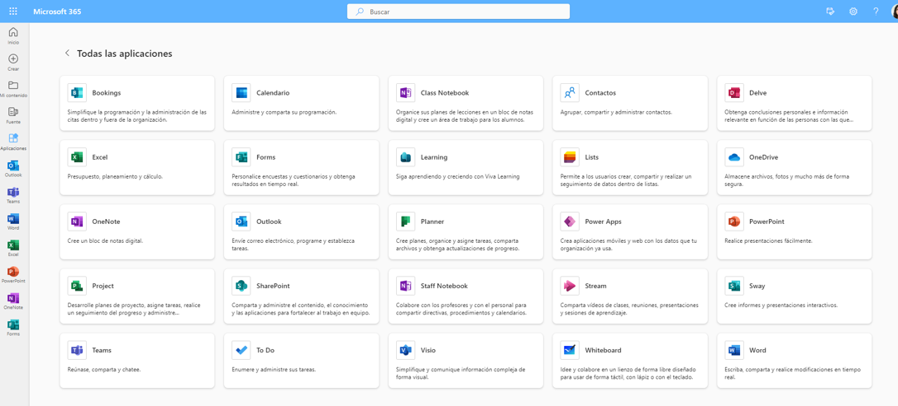
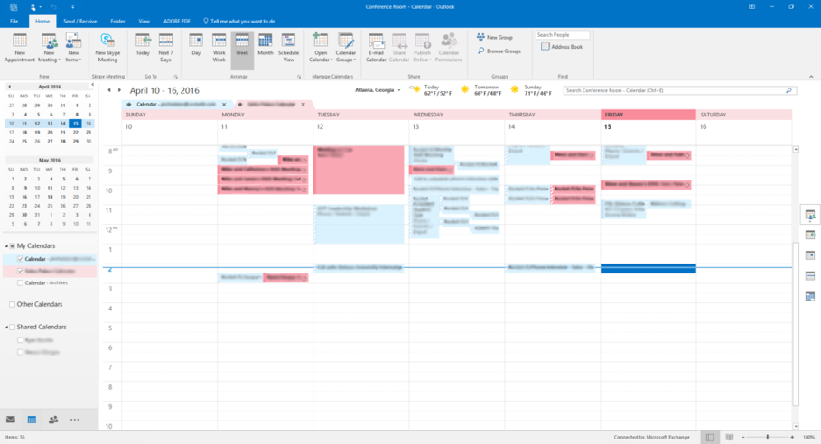
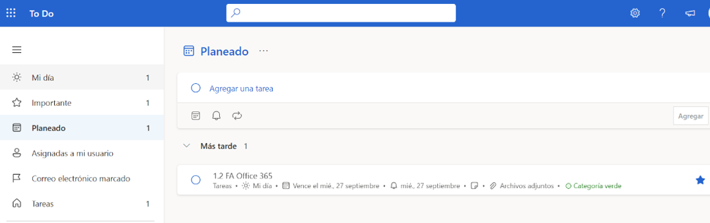

# A1.1: Office 365

Vamos a trabajar con vuestra cuenta de Microsoft `@alu.edu.gva.es` para realizar esta práctica.

Microsoft dispone de todas estas aplicaciones web de escritorio. Vamos a ver algunas de ellas en detalle:

> **Nota:** Siempre que se pida adjuntar una captura de pantalla del trabajo realizado, debe mostrarse la imagen de vuestra cuenta como evidencia.

Para comenzar las actividades, deberéis instalar la aplicación de escritorio de Microsoft Office 365 en vuestro ordenador. Para ello, acceded a la página web de Microsoft y descargad la aplicación correspondiente a vuestro sistema operativo (Windows o macOS). Una vez instalada, iniciad sesión con vuestra cuenta `@alu.edu.gva.es` para acceder a todas las aplicaciones disponibles.

---

## 1. Outlook (Correo y Contactos)

Con la aplicación web de **Outlook**, podemos gestionar el correo electrónico, libreta de direcciones y contactos en un entorno web de escritorio.

Accede a **Outlook** con tu cuenta corporativa y realiza las siguientes configuraciones y comprobaciones:

1 **Configuración de firma personalizada:**
    - Ve a la configuración de Outlook y crea una firma de correo automática con tu nombre completo, curso y centro educativo.
2 **Gestión de contactos:**
    - Añade a tu lista de contactos a dos compañeros/as de clase y al profesor con sus direcciones `@alu.edu.gva.es`.
    - Crea una lista de distribución o grupo de contactos llamado `2SMX-AW` que contenga a dichos miembros.
3 **Envío y organización del correo:**
    - Envía un correo de prueba al grupo de contactos adjuntando un archivo.
    - Crea una carpeta específica para organizar los correos recibidos de la asignatura y mueve el correo de prueba a dicha carpeta.
    - Crea una regla específica para clasificar automáticamente los correos recibidos del grupo creado a esa carpeta.
4 **Evidencias:** Adjunta una captura de pantalla de cada una de las configuraciones realizadas como evidencia del trabajo realizado.

---

## 2. Outlook (Calendario)

Accede a la aplicación **Calendar** de Office 365, elige una semana y crea el horario de clase de esa semana.

Tiene que tener un aspecto parecido al que se muestra a continuación:

El calendario debe cumplir las siguientes especificaciones:

- El nombre del evento debe ser las siglas de la asignatura.
- En la descripción debe aparecer el nombre completo de la asignatura.
- Cada asignatura debe tener un color diferente.
- Debe repetirse semanalmente, hasta el final del curso.
- En una sesión de AW, invita al profesor como asistente, retomando el grupo de contactos `2SMX-AW` creado en el apartado anterior.
- **Evidencia:** Cuando hayas terminado, muestra la vista semanal y haz una captura de pantalla del calendario.

---

## 3. To Do

Existen muchas aplicaciones para organizar el trabajo que debemos realizar. Office 365 proporciona **To Do**, donde podemos crear listas de tareas e indicar que nos las recuerde a una hora determinada.

Crea una tarea para la entrega de esta actividad. Debe tener un aspecto parecido al que se muestra a continuación:

- Fíjate en que está marcada como importante, tiene una categoría y un recordatorio el miércoles 27 de septiembre (elige la hora que prefieras).
- Busca información sobre más aplicaciones web de gestión de tareas.
- Indica a continuación 3 aplicaciones web gratuitas que realicen esta función y describe algunas de sus características.

---

## 4. Trello

Trello es una herramienta de gestión de proyectos basada en la metodología Kanban. Permite organizar tareas y proyectos mediante tableros, listas y tarjetas.

1. Visualiza este vídeo sobre la herramienta [**Trello**](https://www.youtube.com/watch?v=PvggrbuZA9Y).
    - ¿En qué apartados clasifica las tareas?
    - ¿Se pueden establecer recordatorios de las tareas?
    - ¿Qué tipo de elementos se pueden añadir a una tarjeta al editarla?
    - ¿Se pueden compartir las tarjetas (las tareas) con más usuarios?
2. A continuación, responde a estas preguntas relacionadas con el manejo de la aplicación y adjunta evidencias (capturas de pantalla) cuando se indique:
    - Crea una tarjeta nueva en Trello con el título de esta práctica y añádela a una lista de tu elección.
    - Muestra una captura de pantalla de la tarjeta creada y de la lista en la que se encuentra.
    - Añade al menos dos elementos a la tarjeta (por ejemplo, una descripción, una fecha límite o una etiqueta) y vuelve a mostrar una captura de pantalla del resultado final.
    - Explica qué función tienen esos elementos dentro del programa y cómo te ayudan a organizar la tarea.
    - Si es posible, comparte la tarjeta con un compañero/a y adjunta una captura de pantalla del acceso o invitación que hayas realizado.
3. **Evidencia:** Debes adjuntar las capturas de pantalla que demuestren que has trabajado con la aplicación, además de responder a las preguntas planteadas.

---

## 5. Forms

Con esta herramienta podemos crear un formulario y recopilar las respuestas.

Ve a la aplicación **Forms** y crea un formulario nuevo a partir de una plantilla que te guste. El formulario debe tratar sobre un tema que te guste (por ejemplo, una película o libro).

Tiene que cumplir las siguientes especificaciones:

- Debes crear como mínimo una pregunta de cada tipo.
- Debe tener más de una sección.
- Una vez creado, indica que cualquier persona puede responder.
- Pega en esta tarea el enlace al formulario.
- Invita a dos compañeros o compañeras a realizar el test y pega a continuación una captura de pantalla de las estadísticas de las respuestas.
