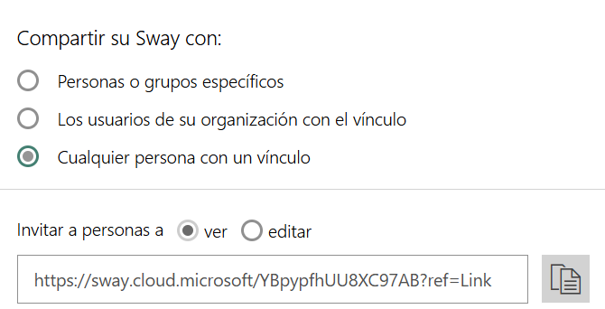
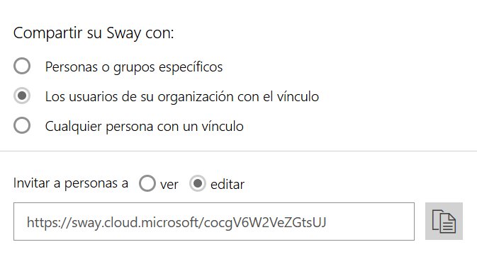

# A2: Publicación web con Microsoft Sway

## Introducción

En esta actividad vamos a trabajar con **Microsoft Sway**, una aplicación web integrada en el entorno Microsoft 365.

Utilizaremos exclusivamente la **cuenta corporativa `@edu.gva.es`**. No es necesario crear ninguna cuenta personal ni utilizar cuentas de Google u otros servicios externos.

!!! info "Antes de empezar"
    Accede a Microsoft 365 con tu identidad digital de Conselleria y comprueba que tienes disponible **Sway** entre las aplicaciones.

## Objetivos

Al finalizar la actividad serás capaz de:

- Crear una publicación mediante una aplicación web.
- Organizar contenido utilizando títulos, texto, imágenes y capturas de pantalla.
- Compartir una publicación mediante un enlace.
- Identificar quién puede acceder a un recurso compartido.
- Comprobar los permisos de acceso utilizando una sesión no autenticada.
- Valorar qué información es adecuada publicar y compartir.

## 1. Accede a Microsoft 365

Inicia sesión con tu cuenta educativa `@edu.gva.es` y abre **Microsoft Sway**.

Si Sway no aparece directamente entre las aplicaciones disponibles, utiliza el buscador de aplicaciones de Microsoft 365.

## 2. Crea una nueva publicación

Crea un nuevo Sway y utiliza como título:

```text
UD01 - Nombre Apellidos
```

Por ejemplo:

```text
UD01 - Mireia García Palau
```

!!! warning "Identidad digital"
    No crees una cuenta nueva para realizar esta actividad. Debes utilizar tu identidad digital educativa.

## 3. Añade el contenido

Tu publicación debe contener, como mínimo, las siguientes secciones.

### 3.1. Bienvenida

Crea una primera sección de presentación que incluya:

- Un título.
- Una breve presentación de la publicación.
- Una imagen relacionada con el contenido.

!!! warning "Privacidad"
    No publiques información personal innecesaria, contraseñas, datos de contacto privados ni imágenes que contengan información sensible.

### 3.2. Actividad anterior

Crea una segunda sección titulada:

```text
Actividad Office 365
```

En ella debes mostrar parte del trabajo realizado en la actividad anterior. Incluye:

- Las preguntas teóricas indicadas.
- Tus respuestas.
- Las capturas de pantalla necesarias.
- Una breve explicación de lo que muestra cada captura.

!!! tip "Importante"
    No es suficiente insertar las capturas de pantalla. Debes explicar **qué has hecho** y **qué demuestra cada captura**.

## 4. Personaliza la publicación

Modifica el diseño de tu Sway para conseguir una publicación clara y fácil de consultar.

Revisa, como mínimo:

- La estructura y el orden de la información.
- Los títulos y las secciones.
- La legibilidad del texto.
- El uso adecuado de imágenes.
- La coherencia general del diseño.

No se valorará únicamente que el resultado sea visualmente atractivo. Lo más importante es que **la información esté correctamente organizada y sea fácil de comprender**.

## 5. Compartición, comprobación del acceso y reflexión final

Abre las opciones de **Compartir** de tu publicación y observa las posibilidades disponibles con tu cuenta educativa.

Ahora vas a comprobar si compartir un enlace significa necesariamente que cualquier persona puede acceder a su contenido. Configura tu publicación de cada una de las siguientes maneras:




Para cada configuración de compartición, realiza los siguientes pasos:

1. Copia el enlace de tu publicación.
2. Abre una ventana **privada o de incógnito** del navegador.
3. Pega el enlace e intenta acceder a la publicación.
4. Observa qué sucede.
5. Realiza una captura de pantalla del resultado.

Crea una tercera sección titulada:

```text
Reflexión sobre el acceso a la publicación
```

Y anota las respuestas a estas preguntas incluyendo las capturas de pantalla:

1. ¿Puedes visualizar la publicación?
2. ¿Microsoft solicita que inicies sesión?
3. Si solicita autenticación, ¿qué cuenta tendría que utilizar el usuario?
4. ¿Quién crees que puede acceder actualmente a tu publicación?

A continuación, en la misma sección responde brevemente y con tus propias palabras:

1. ¿Qué diferencia existe entre **crear** una publicación y **compartirla**?
2. ¿Quién puede acceder actualmente a tu publicación?
3. ¿Qué tendrías que modificar para permitir el acceso a un usuario diferente?
4. ¿Qué información no publicarías nunca en una página accesible públicamente?
5. ¿Qué ventaja tiene utilizar tu identidad digital educativa en lugar de crear una cuenta personal para realizar esta actividad?

## Entrega

Entrega en **Aules** el **enlace a tu publicación de Sway**, configurado en **solo lectura** a los usuarios de tu organización.
