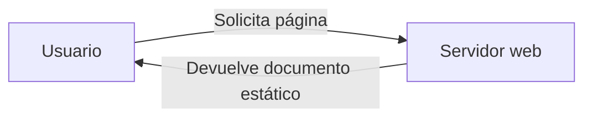
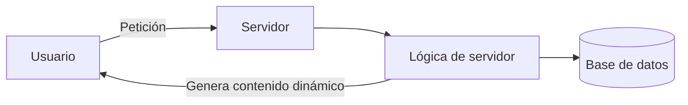
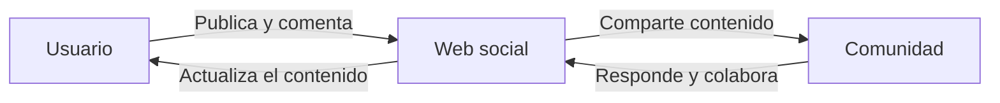
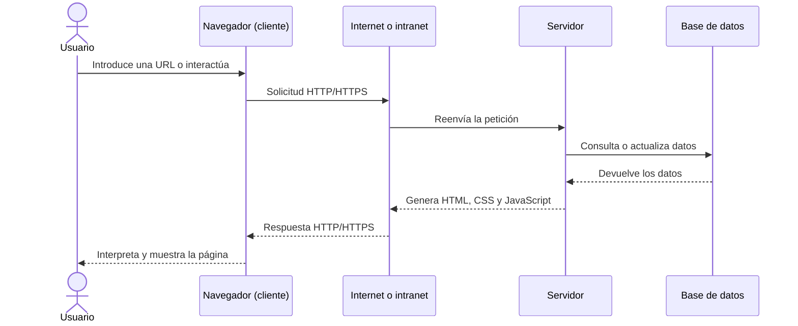

# UD1.1: Internet, la Web y sus aplicaciones

## 1. Introducción: Internet vs. la Web

A menudo se utilizan los términos Internet y la Web como sinónimos, pero hacen referencia a conceptos diferentes:

<iframe width="560" height="315" src="https://www.youtube.com/embed/J8hzJxb0rpc" title="¿Qué es la World Wide Web? - Twila Camp" frameborder="0" allow="accelerometer; autoplay; clipboard-write; encrypted-media; gyroscope; picture-in-picture; web-share" referrerpolicy="strict-origin-when-cross-origin" allowfullscreen></iframe>

### Internet

Es la «red de redes»: una infraestructura física y mundial de ordenadores interconectados para compartir información y recursos mediante fibra óptica, conexiones inalámbricas, 4G/5G, etc. Tiene su origen histórico en el proyecto ARPANET del Departamento de Defensa de los Estados Unidos.

### La Web (World Wide Web, WWW)

Es un sistema interconectado de páginas web públicas que funcionan a través de Internet. Fue inventada por Tim Berners-Lee y Robert Cailliau en el CERN como un sistema para recuperar información fácilmente.

## 2. Evolución de la Web

El uso y las capacidades de la Web han experimentado una evolución constante desde sus inicios:

### Web 1.0 (1989-1997)

Caracterizada por documentos estáticos enlazados. Era un modelo unidireccional (*pull*), donde el usuario solo podía consumir información sin interactuar con ella.

### Web 1.5 (1997-2003)

Aparición de contenidos dinámicos gracias al uso de las primeras arquitecturas y lenguajes de programación tanto en el cliente como en el servidor.

### Web 2.0 (2003-2008)

La web colaborativa y social (blogs, foros, wikis y redes sociales). Pasa a un modelo bidireccional (*push* o prosumidor), donde el usuario no solo consume, sino que también crea contenido.

### Web 3.0 (Web semántica)

Enfoque orientado a hacer la información comprensible para las máquinas, mejorando las búsquedas por contexto y palabras clave. El crecimiento de los dispositivos móviles y la aparición de la nube permitió el desarrollo de aplicaciones web más complejas y potentes.

### Web 4.0 (actualidad e inteligencia artificial)

Etapa centrada en la integración de la inteligencia artificial, los comportamientos predictivos, los asistentes de voz y la automatización avanzada de acciones mediante lenguaje natural.

## 3. Funcionamiento de las aplicaciones web

La arquitectura básica de una aplicación web sigue el modelo cliente-servidor a través de una red (Internet o una intranet):

1. **Cliente (navegador):** realiza una petición, por ejemplo mediante una URL y el protocolo HTTP/HTTPS, solicitando un recurso al servidor.
2. **Servidor:** recibe la petición, procesa el código necesario —con lenguajes de servidor como PHP, Java o .NET— y puede consultar bases de datos.
3. **Respuesta:** el servidor genera el código final (principalmente HTML, CSS y JavaScript) y lo devuelve al navegador del cliente para que lo interprete y lo muestre gráficamente al usuario.

### Ventajas frente al software tradicional

- No requieren instalación ni actualizaciones manuales en los dispositivos de los clientes.
- Utilizan una interfaz universal y conocida por todos: el navegador web.
- Son robustas, escalables y accesibles desde cualquier lugar y dispositivo con conexión a la red.

## 4. El navegador web

El navegador web (*web browser*) es la puerta de acceso a los servicios que ofrece la Web. Su función principal consiste en solicitar páginas al servidor, interpretar el código (HTML, CSS y JavaScript) y presentárselo al usuario de forma interactiva.

Los cinco navegadores más populares son:

- Chrome 
- Firefox 
- Edge 
- Opera 
- Safari 

Las empresas también han adaptado sus navegadores a los sistemas operativos móviles, porque estos actualmente son el canal más utilizado para acceder a las aplicaciones web y navegar.

### Características exigibles

- Fácil de manejar para usuarios comunes.
- Cumplir con los estándares web.
- Rápido y eficiente.
- Seguro.
- Flexible y extensible.
- Bajo consumo de memoria.

## 5. Aplicaciones web de productividad y colaboración

La web actual integra múltiples herramientas orientadas a la productividad, la comunicación y el trabajo en equipo, muchas de ellas ya no se limitan a una sola función, sino que combinan mensajería, almacenamiento, videoconferencia, edición compartida y automatización de tareas.

- **Correo web y administración de mensajes:** servicios como Gmail , Outlook.com  o Microsoft 365  permiten gestionar correos, contactos, filtros automáticos, etiquetas y búsqueda avanzada. También facilitan el acceso desde cualquier dispositivo y la integración con calendarios y aplicaciones de productividad.
- **Calendario web y planificación colaborativa:** aplicaciones como Google Calendar , Microsoft Outlook  o To Do  ofrecen agendas compartidas, recordatorios, disponibilidad de horario, invitaciones a eventos y coordinación entre varios usuarios o equipos.
- **Mensajería instantánea y videollamadas:** herramientas como Microsoft Teams , Google Chat , Zoom  o WhatsApp Web  permiten la comunicación en tiempo real, compartir archivos, crear salas de reunión y colaborar durante la ejecución de proyectos.
- **Documentos y edición colaborativa en línea:** suites web como Google Docs  y Microsoft 365 (Word , Excel , PowerPoint  en línea) permiten crear, compartir y editar archivos simultáneamente desde el navegador, evitando la necesidad de instalar software local.
- **Grupos, foros y comunidades virtuales:** espacios web como Google Groups , Microsoft Teams , Discord  o foros empresariales permiten debatir temas, compartir archivos, resolver dudas y crear comunidades de interés con distintos niveles de acceso.
- **Almacenamiento y sincronización en la nube:** servicios como Google Drive , OneDrive de Microsoft  o Amazon S3/WorkDocs  permiten guardar archivos, compartir información y sincronizar contenido entre distintos dispositivos.
- **Gestión de contenido:** plataformas como WordPress , Joomla  o Drupal  permiten crear, organizar y publicar contenidos web de manera estructurada, con plantillas, plugins y herramientas de SEO.
- **Sistemas de gestión de aprendizaje (LMS):** plataformas como Moodle , Google Classroom  o Canvas  permiten crear cursos, asignar tareas, evaluar el progreso de los estudiantes y facilitar la comunicación entre docentes y alumnos.

Estas herramientas han ido evolucionando desde soluciones muy especializadas hasta plataformas integradas que sustituyen parte del software tradicional del escritorio, especialmente en entornos educativos, profesionales y empresariales.

## 6. Integración de aplicaciones web en el escritorio

Una tendencia clave en la evolución de la web es la difuminación de la frontera entre el escritorio local y el entorno online:

- **Extensiones y tiendas de aplicaciones:** plataformas integradas en los navegadores, como Chrome Web Store, Edge Add-ons o Firefox Add-ons, permiten instalar complementos, herramientas de productividad, bloqueadores, analíticas, asistentes de IA y utilidades de seguridad para ampliar la funcionalidad del navegador sin abandonar la experiencia web.
- **Escritorios web (WebOS):** aplicaciones avanzadas que emulan un sistema operativo completo directamente en el navegador, proporcionando entornos gráficos de escritorio con visores de archivos, editores de texto, hojas de cálculo, clientes de correo, gestión de tareas y herramientas ofimáticas accesibles desde cualquier lugar del mundo, por ejemplo mediante soluciones libres o plataformas en la nube.
- **Entornos colaborativos y de trabajo en la nube:** plataformas como Google Workspace, Microsoft 365 y servicios empresariales ofrecen suites completas para documentar, planificar, programar, comunicarse y colaborar en tiempo real, reduciendo la dependencia del software instalado localmente.

En resumen, la web ya no se limita a mostrar páginas estáticas; se ha convertido en un entorno operativo completo, donde el navegador actúa como punto de acceso a herramientas, servicios y recursos que antes estaban asociados al escritorio físico del usuario.
