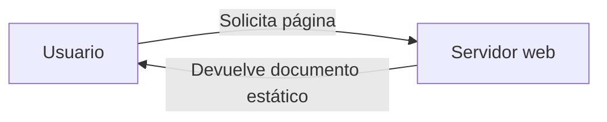
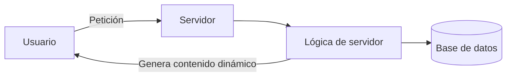
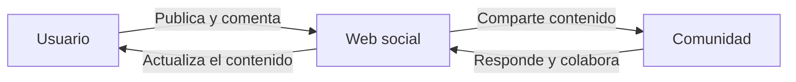
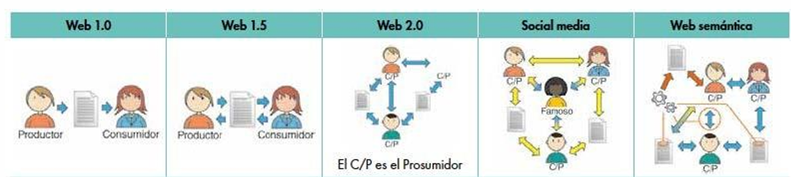
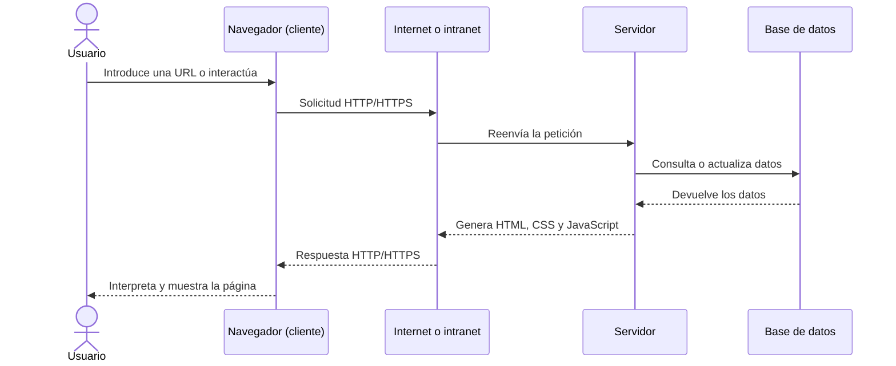
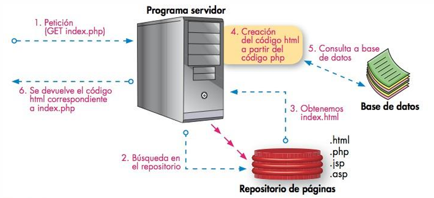

# R1: Internet, la Web y sus aplicaciones

## 1. Introducción: Internet vs. la Web

A menudo se utilizan los términos Internet y la Web como sinónimos, pero hacen referencia a conceptos diferentes:

<iframe width="560" height="315" src="https://www.youtube.com/embed/J8hzJxb0rpc" title="¿Qué es la World Wide Web? - Twila Camp" frameborder="0" allow="accelerometer; autoplay; clipboard-write; encrypted-media; gyroscope; picture-in-picture; web-share" referrerpolicy="strict-origin-when-cross-origin" allowfullscreen></iframe>

### Internet

Es la «red de redes»: una infraestructura física y mundial de ordenadores interconectados para compartir información y recursos mediante fibra óptica, conexiones inalámbricas, 4G/5G, etc. Tiene su origen histórico en el proyecto ARPANET del Departamento de Defensa de los Estados Unidos.

### La Web (World Wide Web, WWW)

Es un sistema interconectado de páginas web públicas que funcionan a través de Internet. Fue inventada por Tim Berners-Lee y Robert Cailliau en el CERN como un sistema para recuperar información fácilmente.

## 2. Evolución de la Web

El uso y las capacidades de la Web han experimentado una evolución constante desde sus inicios:

### Web 1.0 (1989-1997)

Caracterizada por **documentos estáticos** enlazados. Era un modelo unidireccional (*pull*), donde el usuario solo podía consumir información sin interactuar con ella.

```mermaid
flowchart LR
 U[Usuario] -->|Solicita página| S[Servidor web]
 S -->|Devuelve documento estático| U
```

### Web 1.5 (1997-2003)

Aparición de **contenidos dinámicos** gracias al uso de las primeras arquitecturas y lenguajes de programación tanto en el cliente como en el servidor, que podía acceder a una base de datos para generar contenido personalizado.

```mermaid
flowchart LR
 U[Usuario] -->|Petición| S[Servidor]
 S --> L[Lógica de servidor]
 L --> D[(Base de datos)]
 L -->|Genera contenido dinámico| U
```

### Web 2.0 (2003-2008)

La web **colaborativa y social** (blogs, foros, wikis y redes sociales). Pasa a un modelo bidireccional (*push* o prosumidor), donde el usuario no solo consume, sino que también crea contenido.

```mermaid
flowchart LR
 U[Usuario] -->|Publica y comenta| W[Web social]
 W -->|Comparte contenido| C[Comunidad]
 C -->|Responde y colabora| W
 W -->|Actualiza el contenido| U
```

### Web 3.0 (2008-2020)

La web **semántica** es un enfoque orientado a hacer la información comprensible para las máquinas, mejorando las búsquedas por contexto y palabras clave. El crecimiento de los dispositivos móviles y la aparición de la nube permitió el desarrollo de aplicaciones web más complejas y potentes.

### Web 4.0 (2020-actualidad)

La web **inteligente** integra la inteligencia artificial, el aprendizaje automático y el análisis de datos para ofrecer experiencias personalizadas y predictivas. Se centra en la interacción entre humanos y máquinas, permitiendo la automatización de tareas, la recomendación de contenido y la toma de decisiones basada en datos.

Esta etapa también incluye la integración de tecnologías emergentes como la realidad aumentada, la realidad virtual y el Internet de las cosas (IoT).

## 3. Funcionamiento de las aplicaciones web

La arquitectura básica de una aplicación web sigue el modelo cliente-servidor a través de una red (Internet o una intranet):

```mermaid
sequenceDiagram
 actor Usuario
 participant Cliente as Navegador (cliente)
 participant Red as Internet o intranet
 participant Servidor
 participant BD as Base de datos

 Usuario->>Cliente: Introduce una URL o interactúa
 Cliente->>Red: Solicitud HTTP/HTTPS
 Red->>Servidor: Reenvía la petición
 Servidor->>BD: Consulta o actualiza datos
 BD-->>Servidor: Devuelve los datos
 Servidor-->>Red: Genera HTML, CSS y JavaScript
 Red-->>Cliente: Respuesta HTTP/HTTPS
 Cliente-->>Usuario: Interpreta y muestra la página
```

1. **Cliente (navegador):** realiza una petición, por ejemplo mediante una URL y el protocolo HTTP/HTTPS, solicitando un recurso al servidor.
2. **Servidor:** recibe la petición, procesa el código necesario —con lenguajes de servidor como PHP, Java o .NET— y puede consultar bases de datos.
3. **Respuesta:** el servidor genera el código final (principalmente HTML, CSS y JavaScript) y lo devuelve al navegador del cliente para que lo interprete y lo muestre gráficamente al usuario.

### Ventajas frente al software tradicional

- No requieren instalación ni actualizaciones manuales en los dispositivos de los clientes.
- Utilizan una interfaz universal y conocida por todos: el navegador web.
- Son robustas, escalables y accesibles desde cualquier lugar y dispositivo con conexión a la red.

## 4. El navegador web

El navegador web (*web browser*) es la puerta de acceso a los servicios que ofrece la Web. Su función principal consiste en solicitar páginas al servidor, interpretar el código y presentárselo al usuario de forma interactiva. Los tres lenguajes fundamentales que interpreta son:

- HTML, para la estructura de la página
- CSS, para el estilo y presentación
- JavaScript, para interactividad y comportamiento.

Los cinco navegadores más populares son:

- Chrome 
- Firefox 
- Edge 
- Opera 
- Safari 

Las empresas también han adaptado sus navegadores a los sistemas operativos móviles, porque estos actualmente son el canal más utilizado para acceder a las aplicaciones web y navegar.

### Características exigibles

- Fácil de manejar para usuarios comunes.
- Cumplir con los estándares web.
- Rápido y eficiente.
- Seguro.
- Flexible y extensible.
- Bajo consumo de memoria.

## 5. Aplicaciones web de productividad y colaboración

La web actual integra múltiples herramientas orientadas a la productividad, la comunicación y el trabajo en equipo, muchas de ellas ya no se limitan a una sola función, sino que combinan mensajería, almacenamiento, videoconferencia, edición compartida y automatización de tareas.

- **Correo web y administración de mensajes:** servicios como Gmail , Outlook.com  o Microsoft 365  permiten gestionar correos, contactos, filtros automáticos, etiquetas y búsqueda avanzada. También facilitan el acceso desde cualquier dispositivo y la integración con calendarios y aplicaciones de productividad.
- **Calendario web y planificación colaborativa:** aplicaciones como Google Calendar , Microsoft Outlook  o To Do  ofrecen agendas compartidas, recordatorios, disponibilidad de horario, invitaciones a eventos y coordinación entre varios usuarios o equipos.
- **Mensajería instantánea y videollamadas:** herramientas como Microsoft Teams , Google Chat , Zoom  o WhatsApp Web  permiten la comunicación en tiempo real, compartir archivos, crear salas de reunión y colaborar durante la ejecución de proyectos.
- **Documentos y edición colaborativa en línea:** suites web como Google Docs  y Microsoft 365 (Word , Excel , PowerPoint  en línea) permiten crear, compartir y editar archivos simultáneamente desde el navegador, evitando la necesidad de instalar software local.
- **Grupos, foros y comunidades virtuales:** espacios web como Google Groups , Microsoft Teams , Discord  o foros empresariales permiten debatir temas, compartir archivos, resolver dudas y crear comunidades de interés con distintos niveles de acceso.
- **Almacenamiento y sincronización en la nube:** servicios como Google Drive , OneDrive de Microsoft  o Amazon S3/WorkDocs  permiten guardar archivos, compartir información y sincronizar contenido entre distintos dispositivos.
- **Gestión de contenido:** plataformas como WordPress  o Shopify  permiten crear, organizar y publicar contenidos web de manera estructurada, con plantillas, plugins y herramientas de SEO.
- **Sistemas de gestión de aprendizaje (LMS):** plataformas como Moodle , Google Classroom  o Canvas  permiten crear cursos, asignar tareas, evaluar el progreso de los estudiantes y facilitar la comunicación entre docentes y alumnos.

Estas herramientas han ido evolucionando desde soluciones muy especializadas hasta plataformas integradas que sustituyen parte del software tradicional del escritorio, especialmente en entornos educativos, profesionales y empresariales.

## 6. De las aplicaciones web a los entornos de trabajo colaborativos

La evolución de la Web ha transformado la forma de utilizar las aplicaciones informáticas. Al principio, la Web se empleaba principalmente para consultar información y acceder a servicios aislados. Con el tiempo, las aplicaciones web han incorporado funciones cada vez más completas para crear, editar, organizar y compartir contenidos.

Este cambio ha convertido el navegador en un punto de acceso a herramientas que antes se asociaban exclusivamente al escritorio del usuario:

- **Creación y gestión de contenidos:** las aplicaciones web permiten redactar documentos, elaborar hojas de cálculo y presentaciones, organizar archivos, gestionar proyectos y administrar contenidos desde un mismo entorno.
- **Comunicación y colaboración:** varias personas pueden trabajar sobre los mismos documentos, intercambiar comentarios, coordinar calendarios, participar en reuniones y gestionar tareas en tiempo real. La Web deja de ser un medio de consulta para convertirse también en un espacio de participación y trabajo compartido.
- **Integración de servicios:** las plataformas actuales conectan correo, almacenamiento, edición de documentos, mensajería, videoconferencias y automatización. Así, una acción realizada en una aplicación puede relacionarse con los datos y las tareas de otras herramientas del mismo entorno.
- **Acceso desde distintos dispositivos:** la información y las herramientas se apoyan en servicios remotos, por lo que el usuario puede continuar su actividad desde distintos dispositivos y ubicaciones, manteniendo los datos sincronizados.

En resumen, las aplicaciones web han evolucionado desde páginas orientadas al consumo de información hasta entornos operativos y colaborativos completos. Esta evolución ha reducido la separación entre las aplicaciones web y el software tradicional de escritorio.
