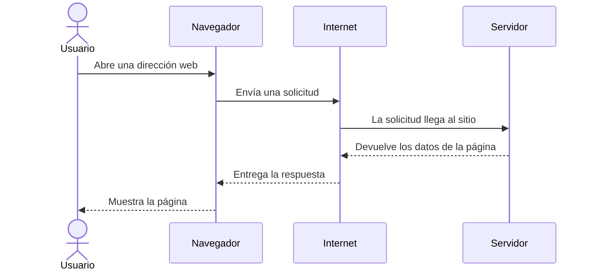

# R2: Conceptos básicos de Internet

## 1. Internet y la Web

### ¿Qué es Internet?

Internet es una red global que conecta miles de millones de ordenadores y otros dispositivos electrónicos. Permite acceder a información, comunicarse con otras personas y utilizar numerosos servicios.

Cuando un dispositivo está **en línea**, significa que está conectado a Internet. Para conectarse desde casa, normalmente se contrata el acceso a un proveedor de servicios de Internet.

### ¿Qué es la Web?

La **World Wide Web** (WWW o Web) es un conjunto de sitios y páginas web al que se accede a través de Internet. La Web es, por tanto, uno de los servicios que funcionan sobre Internet, no otro nombre para la propia red.

Un sitio web puede contener texto, imágenes y otros recursos. Puede servir para consultar noticias, aprender, compartir fotografías o realizar tareas de forma interactiva.

### ¿Cómo funciona?

Al visitar una página, el navegador envía una solicitud a través de Internet al servidor donde se encuentra el sitio web. El servidor procesa la solicitud y devuelve los datos necesarios para que el navegador muestre la página.



## 2. Conexión a Internet

Para enviar y recibir correo, navegar por la Web o reproducir vídeos, los dispositivos necesitan una conexión a Internet. En casa, un router inalámbrico permite conectar varios dispositivos mediante **Wi-Fi** al mismo tiempo.

El tipo de conexión disponible depende de la cobertura y de los servicios que ofrezcan los **proveedores de servicios de Internet** (ISP, por sus siglas en inglés).

### Tipos de conexión

- **Acceso telefónico (*dial-up*):** utiliza la línea telefónica fija y es una conexión lenta. Mientras se usa, no permite utilizar esa línea para llamadas al mismo tiempo.
- **DSL:** ofrece banda ancha a través de una línea telefónica y permite usar Internet y el teléfono simultáneamente.
- **Cable:** utiliza una red de televisión por cable. Su disponibilidad depende de que exista esa infraestructura en la zona.
- **Satélite:** se conecta mediante satélites y puede dar servicio en lugares donde no llegan otras redes terrestres.
- **Red móvil:** conecta los dispositivos de forma inalámbrica a través de la red del operador. La velocidad y los datos disponibles dependen de la cobertura y del plan contratado (por ejemplo, 3G, 4G o 5G).

Los ISP suelen ofrecer distintas velocidades y planes. La velocidad se expresa habitualmente en **Mbps** (megabits por segundo).

### Hardware necesario

- **Módem:** adapta las señales para que los dispositivos puedan comunicarse a través del tipo de conexión contratado. El término procede de *modulador-demodulador*.
- **Router o encaminador:** conecta varios dispositivos entre sí y comparte una conexión a Internet, formando una red local. Muchos routers incluyen un módem integrado.

## 3. La nube y las aplicaciones web

### ¿Qué es la nube?

La **nube** (*cloud*) hace referencia a servicios y recursos disponibles a través de Internet. Cuando un archivo se guarda en la nube, se almacena en servidores remotos en lugar de depender únicamente del disco duro del dispositivo.

Algunos usos habituales son:

- **Almacenamiento de archivos:** guardar documentos, fotografías y otros datos para acceder a ellos desde distintos dispositivos. Algunos ejemplos son Google Drive y Dropbox.
- **Compartición de archivos:** facilitar que varias personas accedan a los mismos archivos.
- **Copias de seguridad:** mantener una copia remota que permita recuperar los datos si el dispositivo se pierde, se daña o deja de funcionar.

### ¿Qué es una aplicación web?

Una **aplicación web** es un programa al que se accede a través de un navegador y que suele procesar o guardar información en servidores conectados a Internet. Por lo general, no es necesario instalarla como un programa tradicional de escritorio.

Google Docs es un ejemplo de aplicación web: permite crear y editar documentos desde el navegador.

Un sitio web puede estar orientado principalmente a presentar información, mientras que una aplicación web permite realizar acciones y trabajar con datos. La diferencia no siempre es estricta: un mismo sitio puede combinar contenido y funciones de aplicación.

## 4. Navegación por la Web

### Navegadores e hiperenlaces

Un **navegador web** es un programa que permite encontrar y visualizar sitios web. Algunos navegadores conocidos son Chrome, Safari, Firefox y Edge.

Un **hiperenlace** (o simplemente enlace) conecta una página o un recurso con otro. Al seleccionar un enlace, el navegador abre el destino indicado.

### Motores de búsqueda

Los **motores de búsqueda** ayudan a encontrar información entre los numerosos sitios disponibles en Internet. Se introduce una consulta y el buscador presenta resultados relacionados. Elegir términos concretos y añadir palabras que describan mejor lo que se busca puede ayudar a obtener resultados más útiles.

El navegador y el motor de búsqueda cumplen funciones distintas: el navegador permite acceder a páginas web; el motor de búsqueda ayuda a localizarlas.

### Direcciones URL

Una **URL** (*Uniform Resource Locator*, o localizador uniforme de recursos) es la dirección de un recurso en la Web. Por ejemplo:

```text
https://www.ejemplo.com:443/carpeta/pagina.html?tema=web#inicio
```

Sus partes principales son:

- **Esquema:** indica cómo debe acceder el navegador al recurso. `https` es el esquema seguro de la Web; también existe `http`.
- **Nombre de dominio:** identifica el sitio o servidor, como `www.ejemplo.com`. El dominio puede incluir subdominios y termina en un dominio de nivel superior, como `.com` o `.es`.
- **Puerto (opcional):** indica un punto de conexión concreto del servidor, como `443` en el ejemplo.
- **Ruta:** señala una página o recurso dentro del sitio, como `/carpeta/pagina.html`.
- **Parámetros (opcionales):** empiezan por `?` y transmiten información adicional, por ejemplo `tema=web`.
- **Ancla (opcional):** empieza por `#` y señala una sección concreta de la página, como `inicio`. Normalmente desplaza la vista sin cargar otra página.

## 5. Evolución de la Web

Una forma sencilla de resumir la evolución de la Web es observar cómo ha cambiado la participación de sus usuarios:

- **Web 1.0 — lectura:** páginas principalmente estáticas; el usuario consulta la información.
- **Web 2.0 — lectura y escritura:** páginas y servicios interactivos en los que los usuarios también publican, comentan y comparten contenido.
- **Web 3.0 — nuevas propuestas de evolución:** las diapositivas la resumen como una ampliación de la lectura y escritura. El término no tiene una definición única y, en otros contextos, se asocia a la Web semántica, como se explica en [R1: Internet, la Web y sus aplicaciones](r01-internet-y-web.md).

## 6. Para ampliar

- [GCFGlobal: tutoriales de Internet](https://edu.gcfglobal.org/)
- [Introducción a Internet](https://www.youtube.com/watch?v=jKA5hz3dV-g&t=88s)
- [Motores de búsqueda](https://www.youtube.com/watch?v=7RlB1CJovTs)
- [Navegadores web](https://www.youtube.com/watch?v=FxirRVJWUTs)
