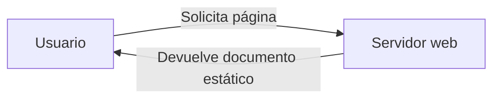
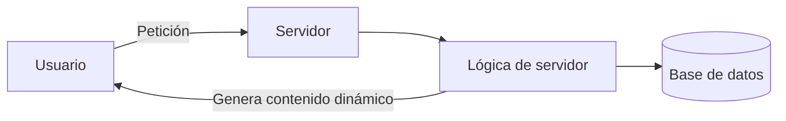
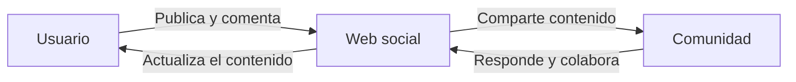
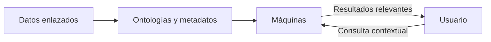
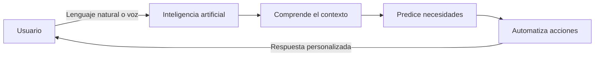
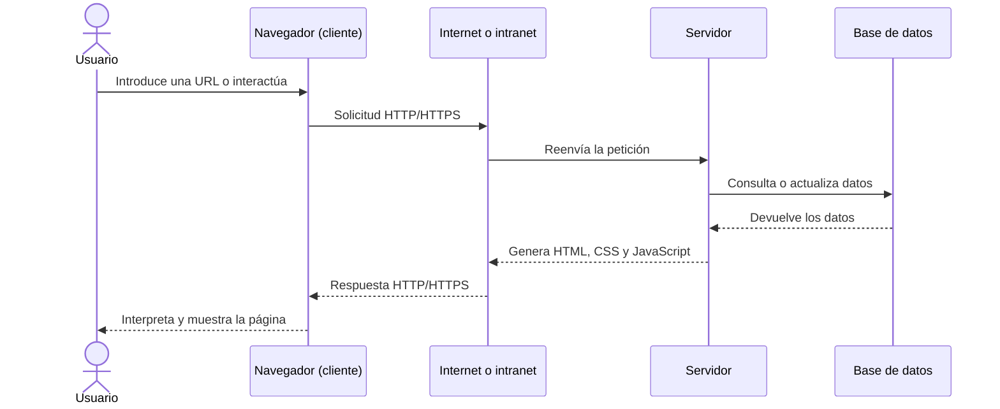

# UD1: Internet, la Web y sus aplicaciones

## 1. Introducción: Internet vs. la Web

A menudo se utilizan los términos Internet y la Web como sinónimos, pero hacen referencia a conceptos diferentes:

### Internet

Es la «red de redes»: una infraestructura física y mundial de ordenadores interconectados para compartir información y recursos mediante fibra óptica, conexiones inalámbricas, 4G/5G, etc. Tiene su origen histórico en el proyecto ARPANET del Departamento de Defensa de los Estados Unidos.

### La Web (World Wide Web, WWW)

Es un sistema interconectado de páginas web públicas que funcionan a través de Internet. Fue inventada por Tim Berners-Lee y Robert Cailliau en el CERN como un sistema para recuperar información fácilmente.

## 2. Evolución de la Web

El uso y las capacidades de la Web han experimentado una evolución constante desde sus inicios:

### Web 1.0 (1989-1997)

Caracterizada por documentos estáticos enlazados. Era un modelo unidireccional (*pull*), donde el usuario solo podía consumir información sin interactuar con ella.

### Web 1.5 (1997-2003)

Aparición de contenidos dinámicos gracias al uso de las primeras arquitecturas y lenguajes de programación tanto en el cliente como en el servidor.

### Web 2.0 (2003-2008)

La web colaborativa y social (blogs, foros, wikis y redes sociales). Pasa a un modelo bidireccional (*push* o prosumidor), donde el usuario no solo consume, sino que también crea contenido.

### Web 3.0 (Web semántica)

Enfoque orientado a hacer la información comprensible para las máquinas, mejorando las búsquedas por contexto y palabras clave.

### Web 4.0 (actualidad e inteligencia artificial)

Etapa centrada en la integración de la inteligencia artificial, los comportamientos predictivos, los asistentes de voz y la automatización avanzada de acciones mediante lenguaje natural.

## 3. Funcionamiento de las aplicaciones web

La arquitectura básica de una aplicación web sigue el modelo cliente-servidor a través de una red (Internet o una intranet):

1. **Cliente (navegador):** realiza una petición, por ejemplo mediante una URL y el protocolo HTTP/HTTPS, solicitando un recurso al servidor.
2. **Servidor:** recibe la petición, procesa el código necesario —con lenguajes de servidor como PHP, Java o .NET— y puede consultar bases de datos.
3. **Respuesta:** el servidor genera el código final (principalmente HTML, CSS y JavaScript) y lo devuelve al navegador del cliente para que lo interprete y lo muestre gráficamente al usuario.

### Ventajas frente al software tradicional

- No requieren instalación ni actualizaciones manuales en los dispositivos de los clientes.
- Utilizan una interfaz universal y conocida por todos: el navegador web.
- Son robustas, escalables y accesibles desde cualquier lugar y dispositivo con conexión a la red.

## 4. El navegador web

El navegador web (*web browser*) es la puerta de acceso a los servicios que ofrece la Web. Su función principal consiste en solicitar páginas al servidor, interpretar el código (HTML, CSS y JavaScript) y presentárselo al usuario de forma interactiva.

### Características exigibles

- Fácil de manejar para usuarios comunes.
- Cumplir con los estándares web.
- Rápido y eficiente.
- Seguro.
- Flexible y extensible.
- Bajo consumo de memoria.

## 5. Herramientas de comunicación y colaboración

La web actual integra múltiples herramientas orientadas a la productividad y la comunicación online:

- **Correo web (Gmail):** servicio de correo electrónico basado en web que destaca por el uso de etiquetas para organizar mensajes, la integración con potentes motores de búsqueda y la gestión unificada de contactos.
- **Calendario web (Google Calendar):** agenda y calendario online que permite programar eventos, planificar tareas y compartir calendarios con diferentes niveles de permisos.
- **Blogs:** cuadernos de notas digitales en formato web, ordenados cronológicamente por entradas y etiquetas, muy versátiles para la publicación de contenidos multimedia y la interacción mediante comentarios.
- **Grupos y foros (Google Groups):** espacios web colaborativos orientados a comunidades con intereses comunes para realizar debates, compartir archivos y gestionar información de forma pública o privada.

## 6. Integración de aplicaciones web en el escritorio

Una tendencia clave en la evolución de la web es la difuminación de la frontera entre el escritorio local y el entorno online:

- **Extensiones y tiendas de aplicaciones:** plataformas integradas en los navegadores, como Chrome Web Store, que permiten instalar complementos, herramientas de productividad y extensiones para ampliar sus funcionalidades.
- **Escritorios web (WebOS):** aplicaciones avanzadas que emulan un sistema operativo completo directamente en el navegador, proporcionando entornos gráficos de escritorio con visores de archivos, editores de texto y herramientas ofimáticas accesibles desde cualquier lugar del mundo, por ejemplo, mediante soluciones libres o plataformas en la nube.